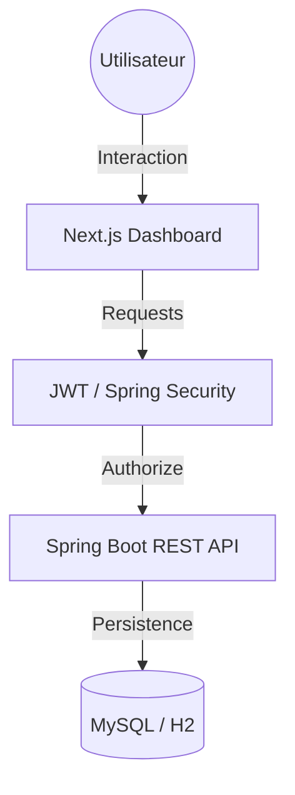

<<<<<<< HEAD
# 📦 QuickLodge : Système de Gestion de Stock

<div align="center">


**Une solution moderne et sécurisée pour le contrôle des flux logistiques.**

[Fonctionnalités](#-fonctionnalités) • [Installation](#-installation-et-configuration) • [Architecture](#-architecture) • [API](#-aperçu-de-lapi)

</div>

---

## 🚀 Fonctionnalités

### 🛡️ Sécurité & Accès
*   **JWT Authentication** : Sessions sans état sécurisées.
*   **RBAC (Role-Based Access Control)** : Hiérarchie `ADMIN` > `MANAGER` > `OPERATOR`.
*   **CORS & CSRF Protégés** : Configuration robuste pour l'interopérabilité.

### 📦 Gestion de Stock
*   **Fournisseurs** : Annuaires complets avec contact et statut actif.
*   **Entrepôts & Localisations** : Tracking précis par site physique.
*   **Inventaire Intelligent** : Suivi des quantités, alertes de stock bas (en dev).
*   **Mouvements** : Historique complet des Entrées/Sorties/Transferts.

---

## 🏗️ Architecture



---

## 📋 Prérequis

| Outil | Version Minimale | Rôle |
| :--- | :--- | :--- |
| **JDK** | 17+ | Environnement d'exécution Java |
| **Node.js** | 18.x | Runtime pour Next.js |
| **MySQL** | 5.7+ | Persistance des données (via XAMPP) |
| **Maven** | 3.6+ | Gestion des dépendances Backend |

---

## ⚙️ Installation et Configuration

### 🟢 1. Backend (Spring Boot)
1.  **Préparation** : Lancez **XAMPP** et MySQL. Créez la base `stock_db`.
2.  **Lancement** :
    ```bash
    cd stock-management/backend
    mvn spring-boot:run
    ```
    *Option rapide (H2) :* `mvn spring-boot:run "-Dspring-boot.run.profiles=h2"`

### 🔵 2. Frontend (Next.js)
1.  **Installation** :
    ```bash
    cd stock-management/frontend
    npm install
    ```
2.  **Lancement** :
    ```bash
    npm run dev
    ```

---

## 🔑 Accès Rapide

| Rôle | Login | Password |
| :--- | :--- | :--- |
| **Administrateur** | `admin` | `admin123` |

---

## � Aperçu de l'API

| Méthode | Endpoint | Description | Accès |
| :--- | :--- | :--- | :--- |
| `POST` | `/api/auth/login` | Authentification & JWT | Public |
| `GET` | `/api/suppliers` | Liste des fournisseurs | Authentifié |
| `POST` | `/api/suppliers` | Ajouter un fournisseur | ADMIN / MANAGER |
| `GET` | `/api/warehouses` | Liste des entrepôts | Authentifié |

---

## 📁 Roadmap du Projet

```text
├── stock-management
│   ├── backend/
│   │   ├── src/main/java/com/stockmanagement/
│   │   │   ├── config/      # Sécurité & Beans
│   │   │   ├── controller/  # Points d'entrée API
│   │   │   ├── entity/      # Modèles de données JPA
│   │   │   └── service/     # Logique métier
│   └── frontend/
│       ├── src/app/         # Routing App Router
│       ├── src/context/     # Auth Context
│       └── src/services/    # Axios API Client
```

---
<p align="center">Développé avec ❤️ pour la gestion de stocks moderne.</p>
=======
# gestion-de-stock
>>>>>>> 8607b515344308b5d21771b4d03f0af20a3f6eac
